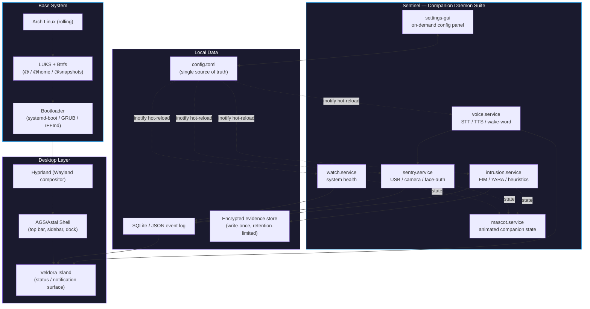
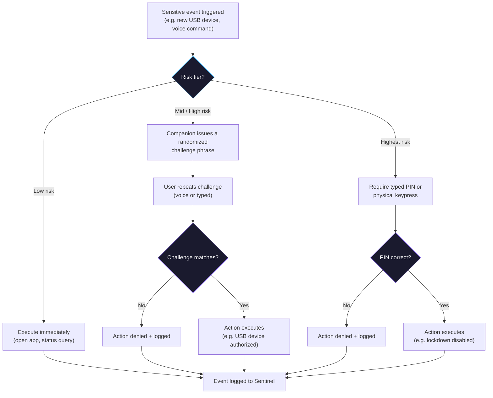
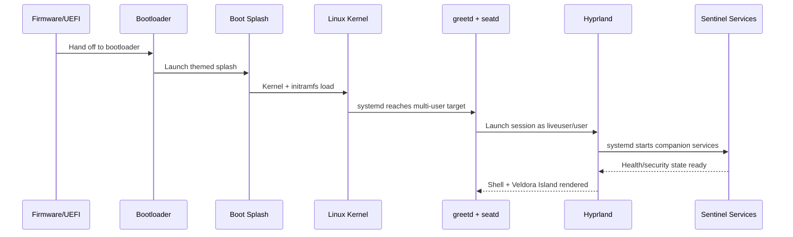

<div align="center">


<br>


<br><br>


</div>

<br>

## 📑 Table of Contents

- [Overview](#-overview)
- [Why This Project](#-why-this-project)
- [System Architecture](#-system-architecture)
- [Security Architecture — Access Control Flow](#-security-architecture--access-control-flow)
- [Boot Sequence](#-boot-sequence)
- [Sentinel — Companion Daemon Suite](#-sentinel--companion-daemon-suite)
- [Key Engineering Decisions](#-key-engineering-decisions)
- [Feature Set](#-feature-set)
- [Tech Stack](#-tech-stack)
- [Comparison vs Established Distros](#-comparison-vs-established-distros)
- [Known Limitations](#-known-limitations)
- [Project Structure](#-project-structure)
- [Roadmap](#-roadmap)
- [Installation](#-installation)
- [Contributing](#-contributing)
- [License & Branding](#-license--branding)
- [About](#-about)

<br>

## 🧭 Overview

**Veldora OS** is an Arch Linux–based operating system designed for developers, cybersecurity
practitioners, and CTF players. It pairs a fully custom Hyprland desktop shell with
**Sentinel**, a background daemon suite that handles system health monitoring, intrusion
detection, access control, and an offline voice/text interface — all built as deterministic,
rule-based logic rather than an LLM-driven agent.

This project spans distribution engineering (`archiso`, disk/boot customization), systems
programming (event-driven daemons, `systemd` service isolation), desktop UI (AGS/Astal shell),
and applied security engineering (USB/camera access control, intrusion detection heuristics,
tiered authorization for sensitive actions). It's documented here at the level I'd want to
walk an interviewer through.

<br>

## 💡 Why This Project

Most security-focused Linux distributions (Kali, Parrot, BlackArch) ship a curated tool set on
top of a fairly conventional desktop. Veldora OS asks a different question: **what would it
look like if the OS itself actively participated in keeping the system secure**, without
becoming a black box?

That constraint shaped every architectural decision in this repo:

- Security logic had to be **explainable** → no LLM in any detection or response path,
  everything is threshold-based and auditable
- Background monitoring had to be **free** → event-driven daemons (`udev`, `inotify`, D-Bus)
  instead of polling loops, so the security layer doesn't cost the performance it protects
- Sensitive actions had to be **hard to trick** → a tiered confirmation model so a single
  voice command (or a replayed recording of one) can never trigger something destructive
- Every component had to be **least-privilege by default** → each daemon is its own sandboxed
  `systemd` service, not one monolithic process with broad system access

<br>

## 🏗 System Architecture



Each `Sentinel` service is an independent, resource-capped `systemd` unit — not a single
process — communicating only through a shared local config file (hot-reloaded via `inotify`)
and an append-only event log. No component has broader system access than its specific job
requires.

<br>

## 🔐 Security Architecture — Access Control Flow

The pattern below governs every sensitive action in the system — USB authorization, disabling
a lockdown, generating an incident report. It's the same tiered-confirmation model applied
consistently, rather than a special case per feature.



**Why this matters**: a voice-only trigger for a security action is vulnerable to replay
attacks — a recording of "authorize device" could be played back. Randomizing the challenge
phrase per request defeats that, without requiring biometric hardware.

<br>

## 🥾 Boot Sequence



<br>

## 🤖 Sentinel — Companion Daemon Suite

| Service | Responsibility | Trigger Model |
|---|---|---|
| `watch.service` | CPU/GPU temp, battery, disk SMART, RAM/swap, failed services | Event-driven + low-frequency polling for sensor reads |
| `sentry.service` | USB default-deny (USBGuard), camera access control, face-aware lock (Howdy) | `udev`, `auditd`, D-Bus signals |
| `intrusion.service` | File integrity monitoring, YARA/heuristic scoring, boot integrity, evidence capture | `inotify`, `fanotify`, scheduled scans |
| `voice.service` | Offline STT/TTS, wake-word detection, tiered command confirmation | Audio input events |
| `mascot.service` | Animated companion state, reflecting the above services' status | Reads shared state file (no independent polling) |
| `settings-gui` | On-demand configuration panel for every service above | User-invoked only, zero idle cost |

Every service runs under its own restricted system user with `ProtectSystem=strict`,
`ProtectHome`, `NoNewPrivileges`, and a minimal `CapabilityBoundingSet` — including
`intrusion.service`, which also includes Sentinel's own binaries in its file-integrity
baseline, so tampering with the watcher is itself a detectable event.

<br>

## ⚙️ Key Engineering Decisions

<table>
<tr><td>

**No LLM in the security path**
Every health/security check is a deterministic rule (threshold → check → response). This was
a conscious trade-off: an LLM could theoretically catch more novel patterns, but at the cost
of predictability and auditability — for a system that decides whether to lock your machine
or block a device, "why did it do that" needs a clear answer.

**Event-driven over polling**
`udev`, `inotify`, `fanotify`, and D-Bus signals drive nearly every daemon. The kernel wakes
the relevant service only when something happens, rather than the service repeatedly checking
state on a timer — the difference between near-zero idle cost and a measurable background tax.

**Crowd-aware face detection**
An early design (any unknown face in frame → lock) would be unusable in public/busy spaces.
The shipped logic requires primary-position framing, sustained duration, and escalates
(warn → lock) instead of triggering instantly — a good example of a feature that needed a
second design pass after stress-testing the naive version mentally against real use.

**Tiered confirmation over blanket voice trust**
Voice interfaces are convenient but replay-attackable. Rather than disable voice control for
anything sensitive, the system tiers actions by risk and escalates the verification method —
preserving convenience for 90% of commands while closing the gap for the 10% that matter.

**Explicit non-goals**
No counter-attack capability against a detected intruder, no software mitigation attempted for
USB Killer-class electrical attacks, no literal public-IP randomization. Documented as
deliberate scope boundaries rather than left ambiguous — a security tool that overclaims its
capabilities is arguably worse than one that's honest about its limits.

</td></tr>
</table>

<br>

## 📦 Feature Set

<details>
<summary><b>Installer & First Boot</b></summary>
<br>

- Custom themed installer — disk setup, LUKS encryption (optional recovery-key generation),
  Btrfs subvolumes
- Automatic hardware detection: CPU microcode, GPU driver stack (incl. hybrid laptop
  switching), wireless chipset drivers (incl. monitor-mode support), fan control, keyboard
  backlight, battery profiles — detected once at install, zero ongoing cost
- Bootloader choice with snapshot-aware boot entries
- One accent color propagates through boot splash, bootloader theme, login screen, and shell

</details>

<details>
<summary><b>Desktop Shell & Veldora Island</b></summary>
<br>

- Dynamic Island–style status pill for notifications, media, and Sentinel alerts
- Categorized tool launcher (recon / web / pwn / forensics / wireless) instead of a flat grid
- Workspaces pre-bound to tool categories

</details>

<details>
<summary><b>Threat Detection</b></summary>
<br>

- File integrity monitoring, YARA + heuristic scoring for unsigned/obfuscated binaries
- Local flood/DDoS defense (rate-limiting, temporary local IP banning), botnet-misuse
  detection
- RAM-anomaly detection with safe remediation (one-click restart, never blind auto-kill)
- Evidence capture + auto-generated incident report template for CERT-In/cybercrime.gov.in
  submission — local-only, never any action against a remote system

</details>

<details>
<summary><b>CTF & Engagement Tooling</b></summary>
<br>

- Auto flag-detector for common CTF formats, logged with context
- Voice-started session timers with auto-generated writeup skeletons
- Engagement profiles — one command swaps VPN, notes folder, workspace layout, and network
  identity, so client work and practice never mix

</details>

<details>
<summary><b>Network Privacy</b></summary>
<br>

- MAC/hostname randomization per connection
- Tor toggle with a real kill switch — traffic stops rather than silently leaking on tunnel
  drop
- DNS leak protection, AppArmor profiles by default, Secure Boot support

</details>

<br>

## 🧰 Tech Stack

<div align="center">


<br><br>


</div>

<br>

## 🆚 Comparison vs Established Distros

| | **Veldora OS** | Kali | Parrot | BlackArch |
|---|:---:|:---:|:---:|:---:|
| Base | Arch (rolling) | Debian | Debian | Arch (rolling) |
| Desktop | Hyprland, GUI-first | Multiple | Multiple | Minimal/DIY |
| Rule-based security companion | ✅ | ❌ | ❌ | ❌ |
| Default-deny USB policy | ✅ | Manual setup | Manual setup | Manual setup |
| Offline voice interface | ✅ | ❌ | ❌ | ❌ |
| Themed GUI installer | ✅ | ✅ | ✅ | ❌ |
| Idle-performance-first design | ✅ | Varies | Varies | Varies |

*Kali, Parrot, and BlackArch remain mature, widely-trusted distributions — this reflects a
different architectural approach, not a claim of replacing them for every use case.*

<br>

## ⚠️ Known Limitations

Documented deliberately — a security project should be explicit about its boundaries.

- **USB Killer**: the access-control layer stops rogue-keyboard/storage attacks but cannot
  stop an electrical/voltage attack — that requires hardware isolation, not software
- **Attacker attribution**: incident reports identify the network an attack originated from,
  not necessarily the individual — framed as an investigative lead, not a confirmed identity
- **Face-unlock**: webcam-based recognition is more spoofable than dedicated depth sensors;
  liveness checks reduce but don't eliminate this, and password fallback always remains
- **No counter-attack capability**, by design — detection and local blocking only

<br>

## 📂 Project Structure

```
VeldoraOS/
├── archiso-profile/       # archiso build profile
│   ├── airootfs/
│   ├── packages.x86_64
│   ├── pacman.conf
│   └── profiledef.sh
├── branding/               # Plymouth theme, wallpapers, os-release
├── shell/                  # AGS/Astal desktop shell
├── companion/               # Sentinel daemon source
│   ├── watch/
│   ├── sentry/
│   ├── voice/
│   ├── intrusion/
│   ├── mascot/
│   └── settings-gui/
├── installer/               # themed installer
├── systemd/                 # unit files, one per service, resource-capped
└── docs/
```

<br>

## 🛣 Roadmap

- [x] Project architecture & specification
- [ ] Bootable Hyprland live ISO
- [ ] Hardware auto-detection + full disk layout
- [ ] Sentinel: health monitoring + intrusion detection
- [ ] Access control (USB / camera / face sentry)
- [ ] Voice pipeline + tiered confirmation
- [ ] Veldora Island + desktop shell
- [ ] Full themed installer
- [ ] Network privacy layer
- [ ] Public 0.1 release

<br>

## 📥 Installation

```bash
# 1. Download the Veldora OS ISO
# 2. Create a bootable USB
# 3. Boot from USB
# 4. Launch the installer
# 5. Follow the installation wizard
# 6. Reboot into Veldora OS
```

<br>

## 🤝 Contributing

Contributions are welcome — this project is built in the open.

- **Bugs**: open an issue with reproduction steps, hardware, and relevant logs
- **Features**: open a discussion/issue before a large PR so direction can be aligned first
- **Code**: fork → feature branch → focused pull request
- **Docs**: small fixes don't need an issue first

Be respectful, be constructive, assume good faith.

<br>

## ⚖️ License & Branding

Original Veldora OS branding, artwork, documentation, and project assets are
**© 2026 Veldora OS Project**. Third-party software included with Veldora OS remains subject
to its own respective license. See `LICENSE` for full terms.

<br>

## 👤 About

<div align="center">

Built by **Aravind V** — B.E. Computer Science (Cyber Security)

<a href="https://github.com/aravind220806">
  
</a>
<a href="https://www.linkedin.com/in/aravind-v2006/">
  
</a>

<br><br>


</div>
