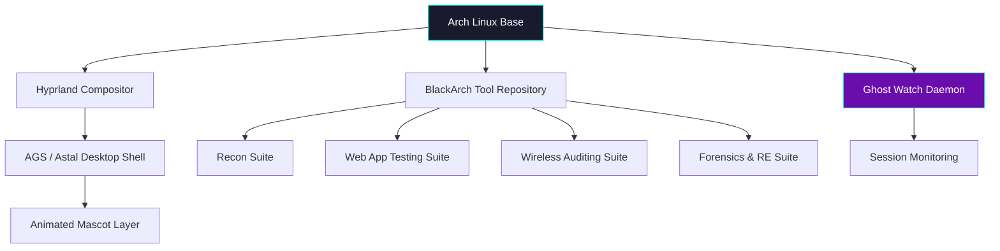

 

---

## 👻 What is Veldora OS?

**Veldora OS** is a custom-built, Arch Linux–based distribution engineered from the ground up for **cybersecurity research, CTF competition, and offensive security work**. It fuses a hand-tuned **Hyprland** desktop with the full **BlackArch** tool catalog, wrapped in an original animated identity and a companion security daemon called **Ghost Watch**.

This isn't a re-skinned Kali. Every layer — the compositor config, the shell, the mascot, the workflow — is purpose-built for the way CTF players and pentesters actually work.

---

## ✨ Core Features

<table>
<tr>
<td width="50%" valign="top">

### 🖥️ Themed Desktop
- Custom **Hyprland** window manager configuration
- **AGS / Astal** desktop shell, fully themed
- Original **animated mascot** woven into the UI
- Aseprite & Rive-driven animation design language

</td>
<td width="50%" valign="top">

### 🛡️ Ghost Watch
- Companion security monitoring system
- Runs alongside your session, watching your back
- Lightweight, always-on presence
- Built to feel native to the OS, not bolted on

</td>
</tr>
<tr>
<td width="50%" valign="top">

### 🧰 BlackArch Tool Layer
- **Recon:** `nmap`, `masscan`
- **Web:** `burpsuite`, `sqlmap`, `ffuf`
- **Wireless:** `aircrack-ng`, `wifite`, `kismet`
- **Forensics/RE:** `ghidra`, `radare2`, `volatility3`

</td>
<td width="50%" valign="top">

### 🚩 CTF Productivity
- Workflow tuned for competition speed
- Pre-configured environments for common categories
- Built by a CTF player, for CTF players
- Designed around real **Rock You** team workflows

</td>
</tr>
</table>

---

## 🏗️ Architecture

---

## 🚀 Project Status

| Phase | Status |
|---|---|
| Spec (~25 sections) | ✅ Complete |
| Hyprland root-launch fix | 🔧 In progress |
| `seatd` integration | 🔧 In progress |
| `mesa` for QEMU GPU rendering | 🔧 In progress |
| Build handoff | ⏳ Queued |

> Currently in **Phase 1 execution** — resolving pre-build blockers before implementation handoff.

---

## 🧑‍💻 About the Builder

- 🔗 GitHub: [@aravind220806](https://github.com/aravind220806)
- 🏴 CTF Team: **Rock You**
- 🎨 Also runs [Scribble Life](https://github.com/aravind220806) — an animation channel that shapes Veldora's visual identity

---

### ⭐ Star this repo if you're into offensive-security distros with actual personality

