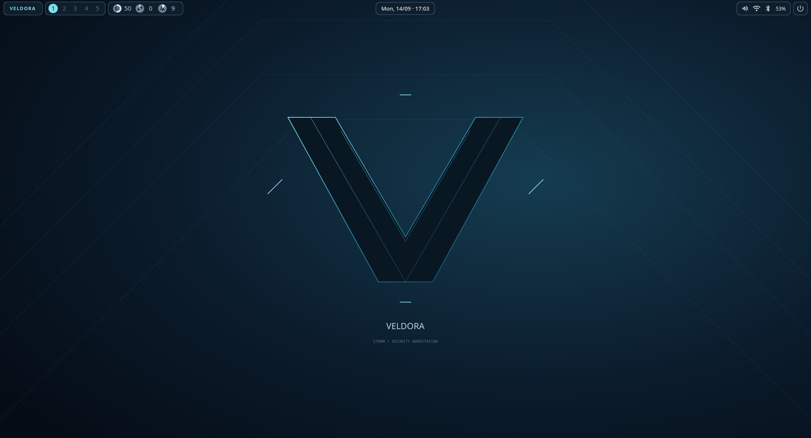

# Veldora Storm desktop

Storm is Veldora's visual theme for the existing end-4 Quickshell integration:
blue-black surfaces, cyan highlights, compact angular panels, an original geometric
wallpaper, and short transitions. It retains upstream overview, search, quick
settings, notifications and media services. This is an adaptation, not an
independently implemented replacement for end-4's shell.

## Controls

| Shortcut | Action |
|---|---|
| Super + S / Veldora bar button | Security workbench |
| Super + Space | Search and application launcher |
| Super + Tab | Workspace overview |
| Super + Shift + V | Clipboard history |
| Super + I / center island | Quick settings and notifications |
| Super + comma | Shell settings |
| Super + L | Lock |
| Super + Return | Terminal |

Theme sources are `shell/theme/storm.json`, `shell/theme/storm-wallpaper.svg`,
`shell/end4/`, and `shell/hyprland.lua`. `scripts/prepare-profile.sh` installs these
into a fresh ISO profile without changing the host desktop. Wallpaper-driven
recoloring is disabled by default to retain the Storm identity. The default
palette is loaded from `storm.json` beside the installed `shell.qml`.

The workbench includes 20 tool entries, installed-state detection, category and
text search, local diagnostics, SHA-256 calculation, and private engagement
folders with report templates. Terminal tools open help; they do not start a scan.
Engagement scope is documentation, not a network enforcement boundary. Folders
are permission-restricted, not encrypted. Live-session files are lost at reboot
unless copied to persistent storage. No automated Sentinel protection is shipped.

## Attribution and distribution

Upstream: https://github.com/end-4/dots-hyprland
Pinned revision and provenance: `vendor/end4/UPSTREAM.md`.
License: `vendor/end4/LICENSE` (GPLv3); third-party notices: `vendor/end4/licenses/`.
Veldora's shell adaptations retain GPL-3.0-or-later notices and modification dates.
The original Storm wallpaper is separately authored for Veldora; it is not an
upstream wallpaper. This project does not imply upstream endorsement.

Keep the license, notices, modified source and required corresponding source
available with distributions. A distinct theme does not cancel the licenses of
reused code. This document is a provenance record, not a guarantee about legal
claims. Original Veldora assets remain under the repository's stated terms.

## Validation limits

The desktop was rendered in an isolated headless Hyprland compositor. Search,
empty-state handling, page navigation and local diagnostics also passed the GTK
workbench smoke test. Physical hardware, live ISO startup, privileged capture,
lock authentication and every upstream optional integration need separate tests.
